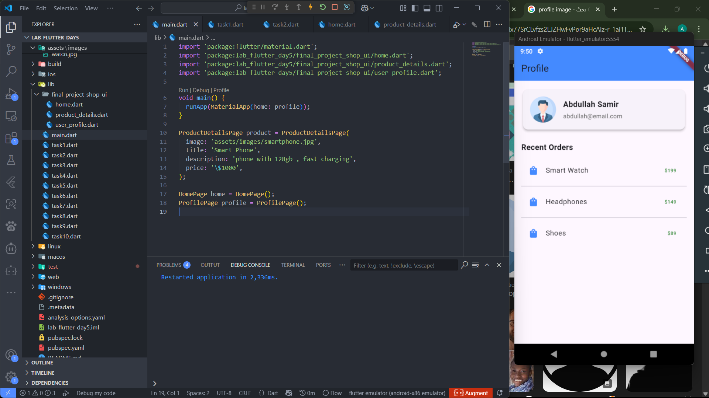

# lab_flutter_day5

A new Flutter project.

## Getting Started

## Task_1 Screen shot run

## Task_2 Screen shot run

## Task_3 Screen shot run

## Task_4 Screen shot run

## Task_5 Screen shot run

## Task_6 Screen shot run

## Task_7 Screen shot run

## Task_8 Screen shot run

## Task_9 Screen shot run

## Task_10 Screen shot run

## Final task Screens shot run (3)

## Home

## Product Details

## User Profile

