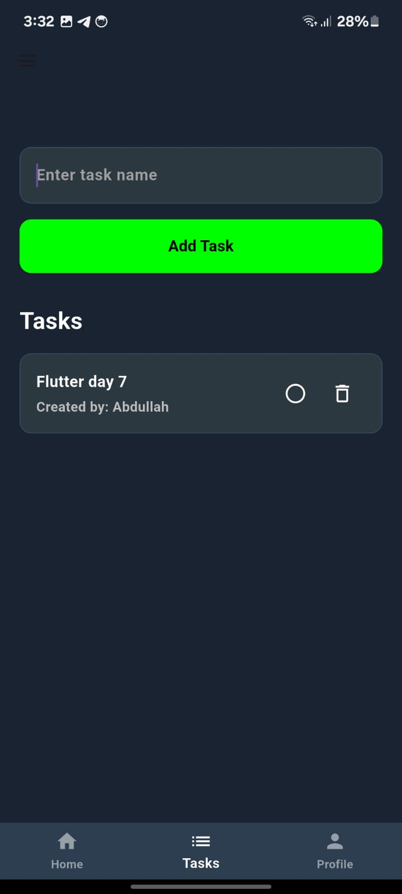
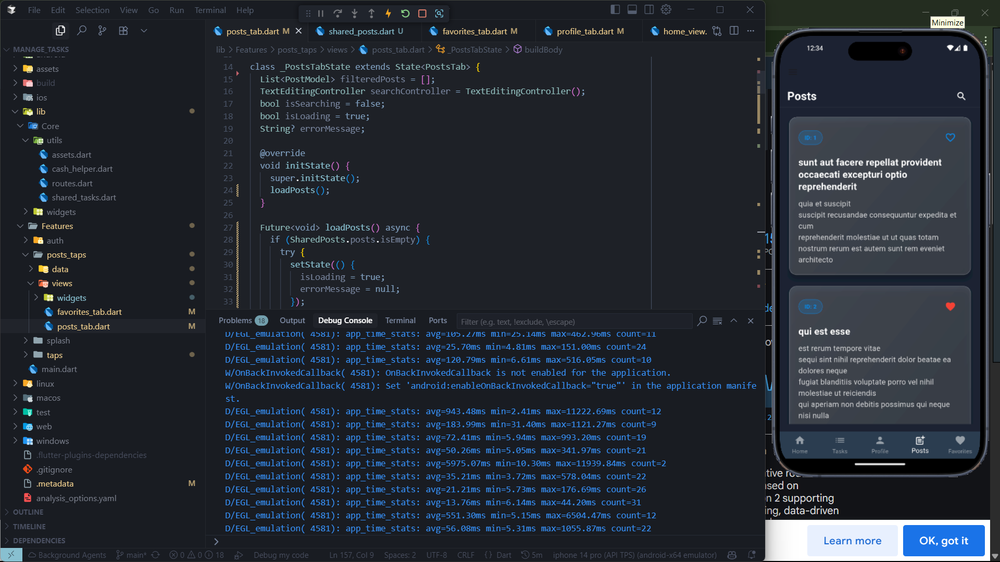
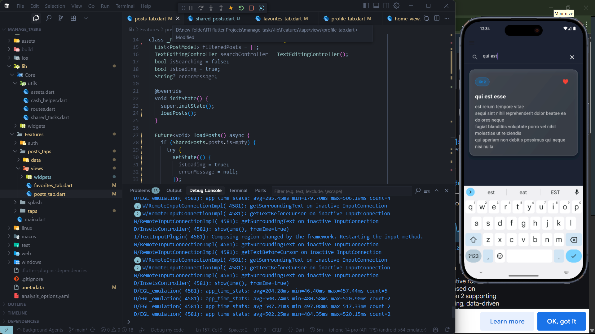
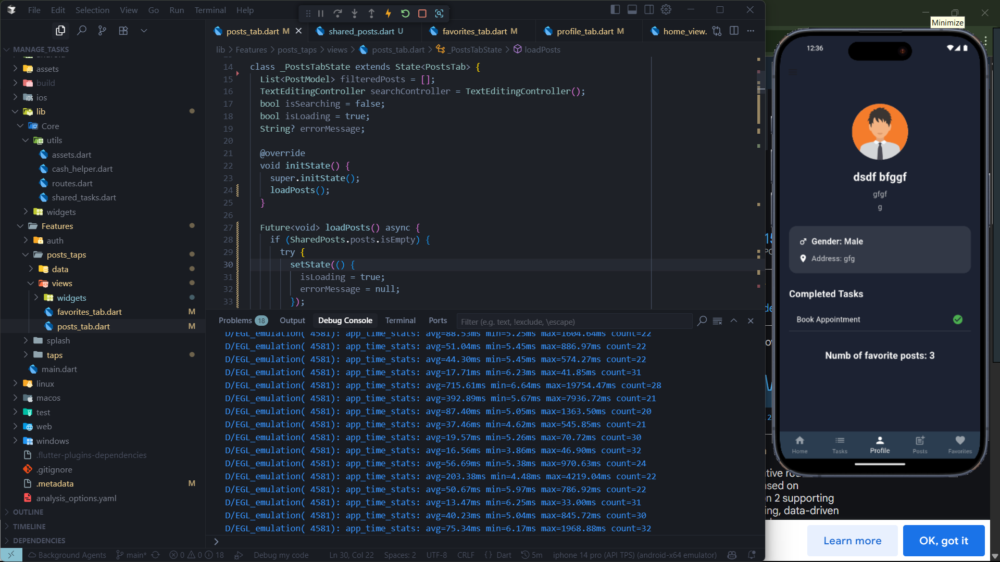

# manage_tasks

A new Flutter project.

## Getting Started

This project is a starting point for a Flutter application.

## Splash Screen

## Create Account Screen without data

## validation

## Create Account Screen with data

## Home page screen 

## Tasks screen with default tasks

## Tasks screen after delet all tasks

## Tasks screen add task (flutter day 7)

## Tasks screen complete task (flutter day 7)

## Profile screen and completed tasks (flutter day 7)

## the Drawer

## logout dialog

## Posts tab

## search for a post

## Favorite posts tab

## Number of favorite posts in profile tab

